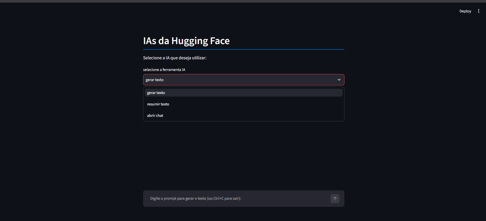

# 🤗 IAs da Hugging Face

Aplicação web construída com **Python** e **Streamlit** que centraliza três ferramentas de Inteligência Artificial em uma única interface, consumindo modelos open-source hospedados na **Hugging Face Inference API**:

- 📝 **Gerar texto** — cria um texto livre a partir de um prompt
- 📄 **Resumir texto** — resume um texto longo de forma objetiva
- 💬 **Abrir chat** — conversa contínua com memória de histórico

<!-- Substitua o link abaixo pelo caminho real do seu GIF depois de subir no repositório -->



---

## ✨ Funcionalidades

| Ferramenta    | Descrição                                                               |
| ------------- | ----------------------------------------------------------------------- |
| Gerar texto   | Recebe um prompt e retorna um texto gerado pelo modelo de IA            |
| Resumir texto | Recebe um texto longo e retorna um resumo claro e objetivo              |
| Abrir chat    | Interface de chat com histórico de mensagens (contexto entre perguntas) |

Todas as ferramentas usam o mesmo modelo de linguagem por baixo dos panos (`Qwen/Qwen2.5-7B-Instruct`), acessado via **Hugging Face Inference Providers**, sem necessidade de rodar nenhum modelo localmente.

---

## 🛠️ Tecnologias utilizadas

- [Python 3.11+](https://www.python.org/)
- [Streamlit](https://streamlit.io/) — interface web
- [huggingface_hub](https://huggingface.co/docs/huggingface_hub) — cliente oficial da API de Inference da Hugging Face
- [python-dotenv](https://pypi.org/project/python-dotenv/) — gerenciamento de variáveis de ambiente
- [certifi](https://pypi.org/project/certifi/) — certificados SSL

---

## 📁 Estrutura do projeto

```
projeto-ia-hf/
├── app.py                     # Interface principal (Streamlit)
├── hfapi_textgeneration.py    # Módulo: geração de texto
├── hfapi_summarization.py     # Módulo: resumo de texto
├── hfapi_chatcompletion.py    # Módulo: chat com histórico
├── requirements.txt           # Dependências do projeto
├── .env.example                # Exemplo de variáveis de ambiente
├── .gitignore                  # Arquivos ignorados pelo Git
└── README.md                   # Este arquivo
```


---

## 🚀 Como rodar localmente

### 1. Clone o repositório

```bash
git clone https://github.com/seu-usuario/projeto-ia-hf.git
cd projeto-ia-hf
```

### 2. Crie e ative um ambiente virtual

**Windows:**

```bash
python -m venv .venv
.venv\Scripts\activate
```

**Linux/Mac:**

```bash
python3 -m venv .venv
source .venv/bin/activate
```

### 3. Instale as dependências

```bash
pip install -r requirements.txt
```

### 4. Configure seu token da Hugging Face

1. Crie uma conta gratuita em [huggingface.co](https://huggingface.co/join)
2. Gere um token de acesso em [huggingface.co/settings/tokens](https://huggingface.co/settings/tokens) com a permissão **"Make calls to Inference Providers"**
3. Copie o arquivo `.env.example` para `.env`:

```bash
cp .env.example .env
```

4. Abra o arquivo `.env` e cole seu token:

```
HF_TOKEN=hf_xxxxxxxxxxxxxxxxxxxxxxxxxxxxxxx
```

> ⚠️ **Importante:** o arquivo `.env` nunca deve ser enviado ao GitHub — ele já está listado no `.gitignore` por segurança.

### 5. Execute a aplicação

```bash
streamlit run app.py
```

O app abrirá automaticamente no navegador em `http://localhost:8501`.

---

## 🧠 Como funciona

O app usa o **Hugging Face Inference Providers**, um sistema que roteia as requisições para diferentes provedores (Groq, Novita, Together AI, Cerebras, entre outros) que hospedam os modelos gratuitamente ou com créditos mensais gratuitos.

Cada ferramenta do menu chama uma função Python diferente:

```python
if ferramenta_selecionada == "gerar texto":
    gerador_texto(prompt)
elif ferramenta_selecionada == "resumir texto":
    resumidor_texto(prompt)
elif ferramenta_selecionada == "abrir chat":
    chat_ia(prompt)
```

E cada uma dessas funções consome um módulo separado (`hfapi_textgeneration.py`, `hfapi_summarization.py`, `hfapi_chatcompletion.py`), todos usando o `InferenceClient` da biblioteca `huggingface_hub` para se comunicar com a API.

---

## 🔄 Trocando o modelo de IA

Quer usar outro modelo? Basta trocar a constante `MODELO` em qualquer um dos arquivos `hfapi_*.py`:

```python
MODELO = "Qwen/Qwen2.5-7B-Instruct"
```

> 💡 Antes de trocar, confira na página do modelo no site da Hugging Face se ele está marcado como **"Inference Available"** (ícone de raio ⚡) — isso garante que ele está ativo em algum provedor no momento.

---

## 📌 Possíveis melhorias futuras

- [ ] Adicionar seleção de modelo pela própria interface
- [ ] Salvar histórico de conversas em arquivo/banco de dados
- [ ] Deploy no Streamlit Community Cloud
- [ ] Adicionar testes automatizados

---

## 📄 Licença

Este projeto está disponível sob a licença MIT. Sinta-se livre para usar, modificar e distribuir.

---

## 👤 Autor

Desenvolvido por **Davi Fernandes** como parte dos estudos em Python e Inteligência Artificial.
